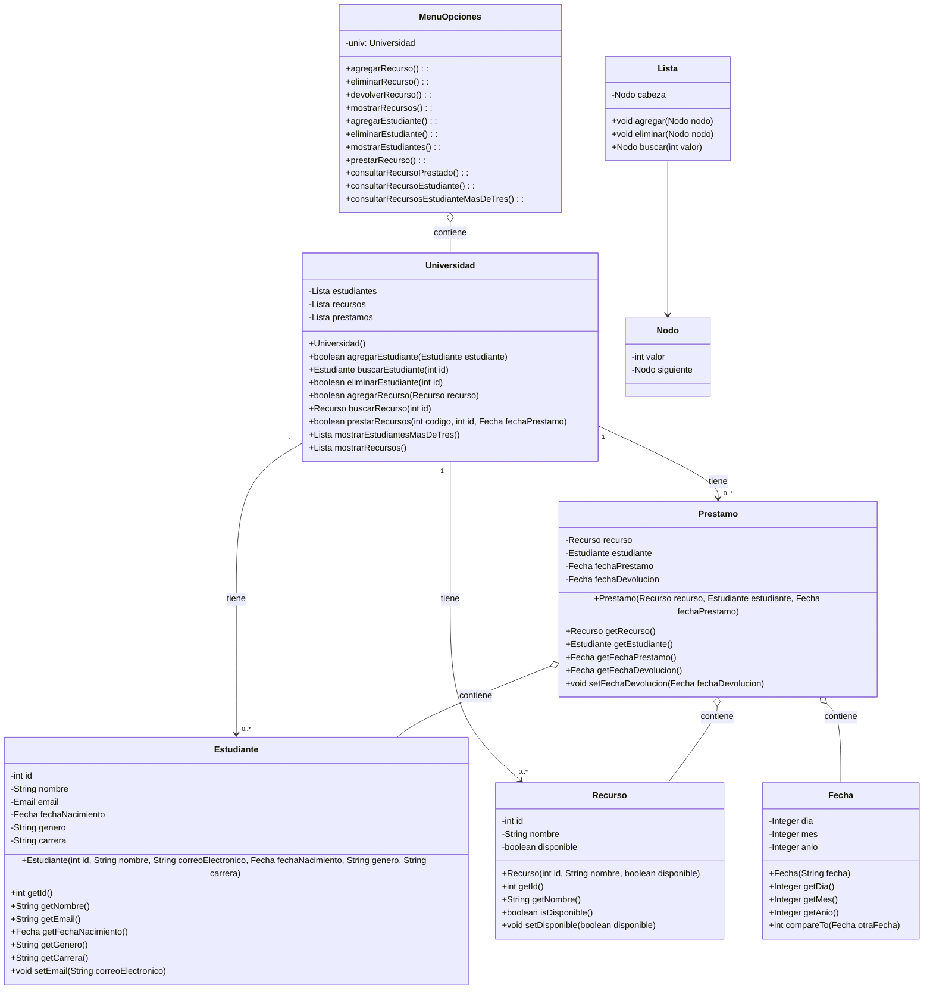

[](https://classroom.github.com/open-in-codespaces?assignment_repo_id=17230585)
# Proyecto - Ejercicio Integrador de Préstamo de Recursos #

## Descripción del Problema ##
Se requiere construir una aplicación para la central de préstamo de una Universidad, la cual se encarga de manejar el préstamo de todos los recursos que la universidad ofrece a sus estudiantes.

Los recursos pueden ser de cualquier naturaleza como instrumentos musicales, artículos deportivos, etc. Cada recurso se identifica con un código y tiene un nombre. 
Un ejemplo de recurso puede ser una guitarra cuyo nombre es “Guitarra Honner” y su código el número 10. Los códigos son únicos, pero los nombres puede repetirse (puede hacer varia “Guitarra Honner”, con distintos códigos). Cada recurso que se quiera prestar a los estudiantes debe ser registrado en la aplicación. Un recurso se puede prestar solo si está disponible, es decir que no se haya prestado a otro estudiante.

Un estudiante se identifica por código, que también es único, y tiene un nombre, email, fecha de nacimiento, sexo y programa académico. Para que un estudiante pueda prestar algún recurso, deberá estar registrado en el sistema. Si el estudiante no esta registrado, no se le prestará ningún recurso.
Se plantea solucionar el problema utilizando el uso de listas.

A continuación, se muestra la solución utilizando un diagrama de clases.

La clase Recurso representa cada recurso a prestar (guitarras, balones, faultas).
La clase Estudiante representa un estudiante que solicita préstamos.
La clase Prestamo representa un préstamo que contiene un Recurso que se presta, el Estudiante que solicita el recurso, y las fechas de préstamos y devolución.

Finalmente la clase Universidad representa un contenedor general que contiene una lista de estudiantes, recursos y préstamos.

Los atributos de la clase Universidad son de tipo Lista.

La clase Universidad posee los métodos que solucionan los requisitos de la aplicación (prestar recurso, devolver recurso, consultar recurso que tiene un estudiante, etc).


## Funcionalidades Implementadas ##
1. Gestión de Estudiantes: Los estudiantes podrán registrarse en la aplicación proporcionando detalles como su nombre, edad, etc. También podrán actualizar o eliminar su información.

2. Gestión de Recursos: La aplicación permitirá a la universidad añadir, actualizar o eliminar recursos que están disponibles para préstamo. Cada recurso tendrá detalles como nombre, descripción, estado (disponible o prestado), etc.

3. Solicitud de Préstamos: Los estudiantes podrán buscar recursos disponibles y solicitar un préstamo. Al solicitar un préstamo, se registrará la fecha del préstamo y se actualizará el estado del recurso a "prestado".

4. Devolución de Préstamos: Cuando un estudiante devuelve un recurso, se registrará la fecha de devolución y se actualizará el estado del recurso a "disponible".

5. No se puede devolver un recurso con una fecha inferior a la fecha de préstamo

6. Seguimiento de Préstamos: La aplicación mantendrá un registro de todos los préstamos, incluyendo el estudiante que solicitó el préstamo, el recurso prestado, la fecha del préstamo y la fecha de devolución. Esto permitirá a la universidad rastrear el uso de sus recursos.

7. Interfaz de Usuario: La aplicación proporcionará una interfaz de usuario fácil de usar que permitirá a los estudiantes y al personal de la universidad interactuar con la aplicación. La interfaz de usuario incluirá menús y opciones para realizar todas las funciones mencionadas anteriormente.

8. La apliacación deberá precargar una lista de estudiantes, definidos en el archivo estudiantes.txt y una lista de recursos, definidos en el archivo recursos.txt al inicio del proyecto.


## Uso del Proyecto ##
El proyecto se puede compilar, probar y ejecutar utilizando los siguientes comandos:

make: Compila, prueba y ejecuta la aplicación.
make compile: Compila la aplicación.
make test: Ejecuta las pruebas unitarias.
make run: Ejecuta la aplicación.
make clean: Limpia los archivos binarios generados.
Contribución al Repositorio
Para contribuir al repositorio, se deben seguir los siguientes pasos:

Realizar los cambios necesarios en los archivos.
Agregar los cambios al área de preparación utilizando el comando git add ..
Hacer un commit de los cambios con un mensaje descriptivo utilizando el comando git commit -m "Descripción del cambio".
Enviar los cambios al repositorio remoto utilizando el comando git push origin main.

#### Este ejercicio implementa ####
      Un Sistema de Gestión de Préstamos Uiversitarios
        
      
## Diagrama de clases



## Diagrama de clases UML con draw.io
El repositorio está configurado para crear Diagramas de clases UML con ```draw.io```. Para usarlo simplemente agrega un archivo con extensión ```.drawio.png```, das doble clic sobre el mismo y se activará el editor ```draw.io``` incrustado en ```VSCode``` para edición. Asegúrate de agregar las formas UML en el menú de formas del lado izquierdo (opción ```+Más formas```).


## Uso del proyecto con make

### Default - Compilar+Probar+Ejecutar
```
make
```
### Compilar
```
make compile
```
### Probar todo
```
make test
```
### Ejecutar App
```
make run
```
### Limpiar binarios
```
make clean
```
## Comandos Git-Cambios y envío a Autograding

### Por cada cambio importante que haga, actualice su historia usando los comandos:
```
git add .
git commit -m "Descripción del cambio"
```
### Envíe sus actualizaciones a GitHub para Autograding con el comando:
```
git push origin main
```
## Comandos individuales
### Compilar

```
find ./ -type f -name "*.java" > compfiles.txt
javac -encoding utf-8 -d bin -cp lib/junit-platform-console-standalone-1.5.2.jar @compfiles.txt
```
### Ejecutar ambos comandos en 1 sólo paso:
```
find ./ -type f -name "*.java" > compfiles.txt ; javac -encoding utf-8 -d bin -cp lib/junit-platform-console-standalone-1.5.2.jar @compfiles.txt
```

### Ejecutar Todas la pruebas locales de 1 Test Case
```
java -jar lib/junit-platform-console-standalone-1.5.2.jar -class-path bin --select-class miTest.AppTest
```
### Ejecutar 1 prueba local de 1 Test Case
```
java -jar lib/junit-platform-console-standalone-1.5.2.jar -class-path bin --select-method miTest.AppTest#appHasAGreeting
```
### Ejecutar App
```
java -cp bin miPrincipal.Principal
```
Los comandos anteriores están considerados para un ambiente Linux. [Referencia.](https://www.baeldung.com/junit-run-from-command-line)